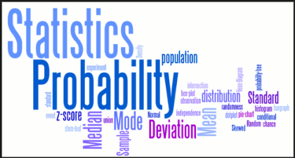

STATISTICS-PROBABILITY 

  

## **Overview**
This repo contains books, courses, certifications, websites, and nanodegrees that have helped me in strengthning/revising my statistics-probability foundations necessary for Artifical Intelligence. Its been a while since I got my masters degree so some concepts were rusty :). I initally thought of creating two seperate repos but stats and prob are interlated so it helped me better organizing content this way. Organization of content helps me to document my learning experience along the way. Organization of content is also based on how topics are linked to leach other and in what order it might be helpful to learn each topic. If the organization of content helps someone else in their journey then even better. Individual learnings or takeaways of each of the below sections are within their respective README files 

# **Table Of Contents**

### **Books**
1. [TBD]()
2. [TBD]()
3. [TBD]()
4. [TBD]()

### **Courses**
1. [Statistical Thinking in Python 01: DataCamp]()
2. [Statistical Thinking in Python 02: Datacamp]()
3. [Intro to Descriptive Statistics: Udacity]()
4. [Intro to Inferential Statistics: Udacity]()
5. [Inferential Statistics: Coursera]()
6. [Statistics 110: Probability]() 
7. [Introduction to Probability and Data: Coursera]()

### **Certifications**
1. [TBD]()
2. [TBD]()

### **Nanodegrees**
1. [TBD]()
2. [TBD]()

### **Notebooks**
1. [Basic statistics]()
2. [Basic probability]()
